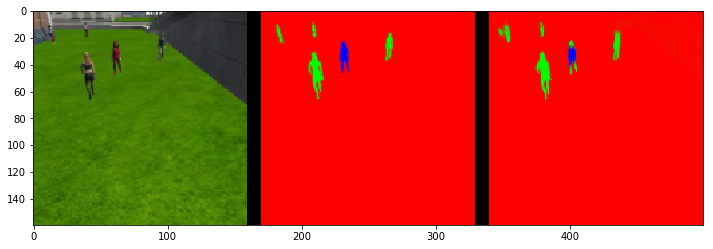

# Project : Follow Me

##Introduction

The goal of this project is to train an Fully Convolutional Network (FCN) in detecting and locating an individual in an environment that is crowded with other people. This model can be utilized by a drone to track and follow the target.

## Data collection
The initial training, and validation datasets provided for this project where 4144, and 1186 images respectively. Further training, and validation datasets where collected using the provided Unity simulator, where 2681 more training images, and 761 more validation iamges were collected. Simulations were setup using the proposed methods outlines in the Follow Me project guide:

* Data gathered by following the hero in a very dense crowd.

* Data gathered while in patrol directly over the hero, while they zigzag.

* Data gathered while the quad is on standard patrol.


In order to maximize data that includes the target while the drone is not in follow mode, multiple data collection runs were done by moving the drone manually to track the target, as well as to monitor distance from the target.

Upon first running training the model, evaluating the test data showed that the FCN had a difficult time segementing the hero at distances far from the drone, where the hero would only encompass a few pixels of the image. Additional training data was captured by manually moving the drone far away from the hearo, and crowd path, as displayed in the image below.

* Data gathered with hero and crowd far from drone.


## Network Architecture

A typical convolutional neural network consistant of multiple colvolutional and pooling layers using non-linear activation functions, followed by a fully connected layer, and finally a softmax activation function for classification. However, fully connected layers don't preserve spatial information so the task of locating an object with a picture using a traditional convolutional neural network is not possible.

To solve this issue a state of the art neural network model called a fully convolutional network (FCN) can be developed which preserves the spatial information of the image. An FCN typically consistes of an encoder, a 1x1 convolution layer, and a decoder. The encoder is used to extract useful features from the image using convolutional filters. The 1x1 convolutional layer replaces the fully connected layer, where the output tensor will not be flattened thus spatial information will be preserved. The decoder is essentially a reverse convolution called a transpose convolution, which upsamples the image restoring spatial information at the output. The last essential part of an FCN is the use of skip connection with previous layers in the encoder to bring forward spatial information that might have gotten lost during encoding.

The code below is the overall FCN model used in this project where ReLU activation functions are used for each convolutional layer in the model.

```python
def fcn_model(inputs, num_classes):

    # TODO Add Encoder Blocks.
    # Remember that with each encoder layer, the depth of your model (the number of filters) increases.
    en_L1 = encoder_block(inputs, 64, 2)
    en_L2 = encoder_block(en_L1, 128, 2)

    # TODO Add 1x1 Convolution layer using conv2d_batchnorm().
    conv1 = conv2d_batchnorm(en_L2, 256, 1, 1)

    # TODO: Add the same number of Decoder Blocks as the number of Encoder Blocks
    dec_L1 = decoder_block(conv1, en_L1, 128)
    x = decoder_block(dec_L1, inputs, 64)

    # The function returns the output layer of your model. "x" is the final layer obtained from the last decoder_block()
    return layers.Conv2D(num_classes, 3, activation='softmax', padding='same')(x)
```

After each convolutional layer in the proposed model, the outputs are put through a batch normalization layer. Normalizing the outputs of each layer gets rid of covarient shift, which in turn reduces the computational cost of the optimizer, speeding up model training. The figure below illustrates how batch normilization can increase training efficiency.


In order to further optimize the efficiency of the FCN, seperable convolutions are used to essentially factorize the dimensionality of a convolution kernel into two smaller kernels [[1]]. In doing so we can reduce the number of parameters needed for the model, improving efficiency of the model without losing information.

```python
def encoder_block(input_layer, filters, strides):

    # TODO Create a separable convolution layer using the separable_conv2d_batchnorm() function.
    output_layer = separable_conv2d_batchnorm(input_layer, filters, strides)

    return output_layer
```

The encoder and decoder blocks are connected with a 1x1 convolutional layer. this has the benefit of preserving spatial information of the image, where fully connected layers would not. Therefore the dimenionality of the ouput tensor from the encoder will be preserved.  

A decoder is then used to upsample the encoder output back to the original input image size through the use of transposed convolutions [[2]]. However in this project, in order to optimize for speed, this upscaling can be achieved artifically using bilinear upsampling,  and layer concatenation, followed by seperable convolution layers. The figure below illustrated the upsampling process.

Bilinear upsampling in this model scales the input by a factor of 2. This upsampled layer is then concatenated with a layer from the encoder that has more spatial information than the upsampled layer. In doing this, some spatial information lost during the encoding phase can be carried forward for future convolutional layers in the decoder to learn from. For this model two convolutional layers are performed for each decoder block with a stride of 1.

```python
def decoder_block(small_ip_layer, large_ip_layer, filters):

    # TODO Upsample the small input layer using the bilinear_upsample() function.
    upsampled = bilinear_upsample(small_ip_layer)

    # TODO Concatenate the upsampled and large input layers using layers.concatenate
    concat_layers = layers.concatenate([upsampled, large_ip_layer])

    # TODO Add some number of separable convolution layers
    output_layer = separable_conv2d_batchnorm(concat_layers, filters)
    output_layer = separable_conv2d_batchnorm(output_layer, filters)

    return output_layer
```

Finally the output layer consists of a convolutional layer with a softmax activation function to make a segementation of the image between the three output classes. The figure below illustrates the optimal network architecture settled on for this project.


## Parameters

The first experiment performed consisted of more encoder convolution steps than the decided model, downsampling filter depth from 16, 32, 64, and finally 256. For this first iteration the only training set used was the base one provided by the project. Learning rate was also set fairly high at 0.05. This model wouldn't train after 10 epochs with an increasing training loss function. On the next iteration, more data was collected for the model, reducing the convolution steps in the encoder to 2, and only downsampling to a filter depth of 64. Learning rate was also decreased to 0.01. This model trained with the loss function reaching 0.018, however with an IOU of 0.51, and a final score of 0.38, this model did not reach a passing grade. For the final model more data was collected focusing on the hero and crowd at a far distance. The encoder blocks were set to include a deeper filter depth to 256 in order to get more output channels. The hyperparameters used for the final model were:

```python
learning_rate = 0.01
batch_size = 65
num_epochs = 20
steps_per_epoch = int(6825/batch_size)
validation_steps = 50
workers = 10
```

Learning rate was set fiarly low as typically a slower learning rate will producea better optimization, but too slow the model training will increase in compute, and may fail to train altogether. Batch size was chosen in order to get an even number of batches given the data set of 6825 images. Number of epochs was gauged by incrementing epochs by ten until is was deemed that adding more epochs would not result in a siginificantly lower loss function. Steps per epoch ware set as an even increment of total images over batch size, where batch size was chosen so that the steps would turn out to be an even number. Workers were chosen at 10 to try an increase training time utilizing more compute power.

Training this model over 20 epochs the final training loss was 0.0215, and the validation loss was 0.0272.


From the sample evalution data the model was shown to be very accurate in following the target:


Fairly accurate in segementing the crowd, although it was picking up edges on buildings:


And still having some difficulty picking out the hero in a crowd:


This resulted in an IOU of 0.549, and a intersection over union of 0.431, passing the 0.4 criteria laid out in the project rubric.


## Future Enhancements

Even after more data was collected to try and train the model to segment the hero at far away distances, the model failed in nearly every occurance of this type.


To improve this model a deeper model with more features could be trained to try an detect these low resolution features. More data could also be taken as a dataset of <10000 is fairly small and suseptable to underfitting. increasing the numebr of epochs by a large amount might also help, however this will drastically incresase the training time of the model. Adding regularization, dropout, and pooling layers to the model might also help improve performance.

Creating another object to follow in the simulator such as an animal or another human would be a good way to challenge the verasatility of this model. It should easily be able to classify between an animal and human given the current use case.

The image below was taken from the Unity simulator in follow me mode using the model trained in this project:


[1]: https://www.tensorflow.org/api_docs/python/tf/keras/layers/SeparableConv2D
[2]: https://www.tensorflow.org/api_docs/python/tf/contrib/layers/conv2d_transpose
